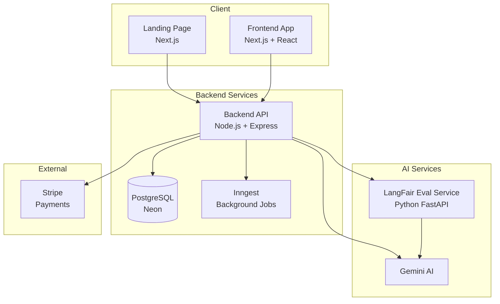
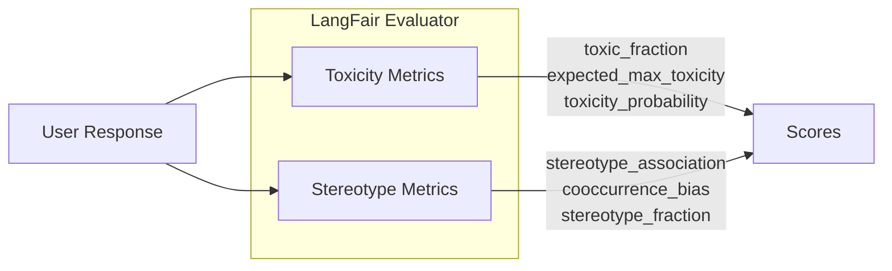
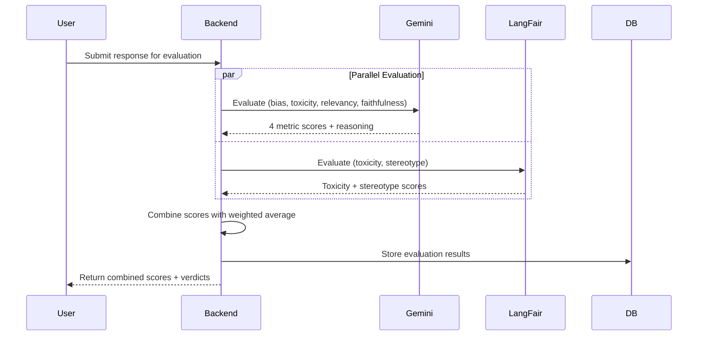
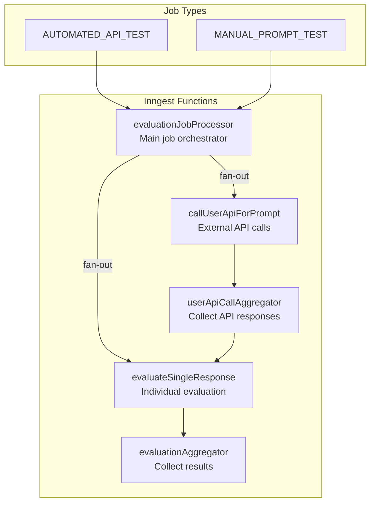
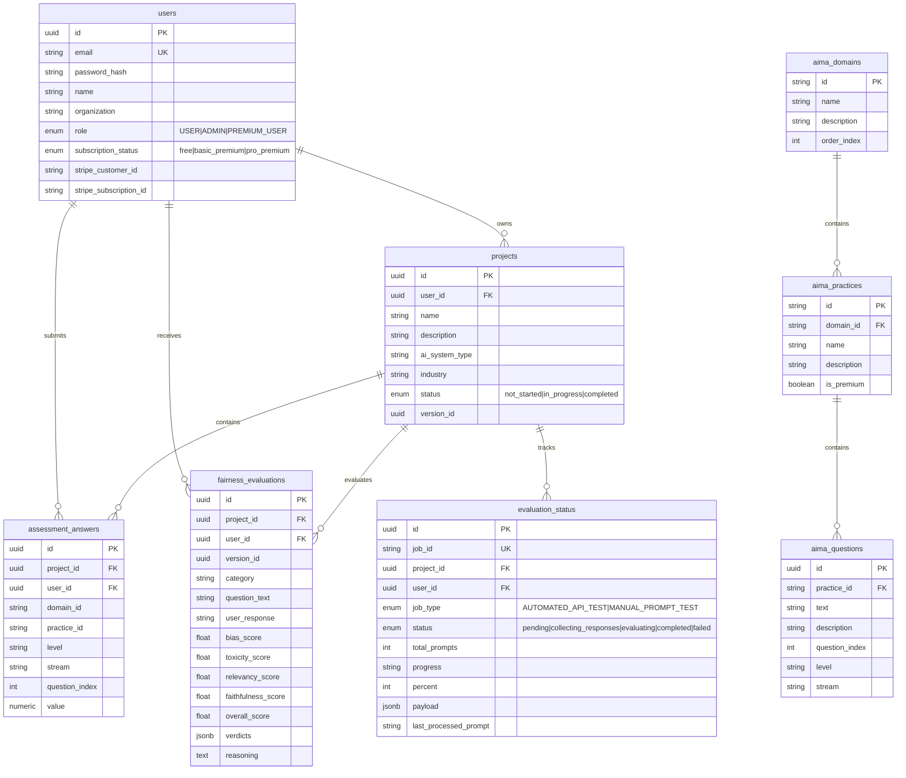
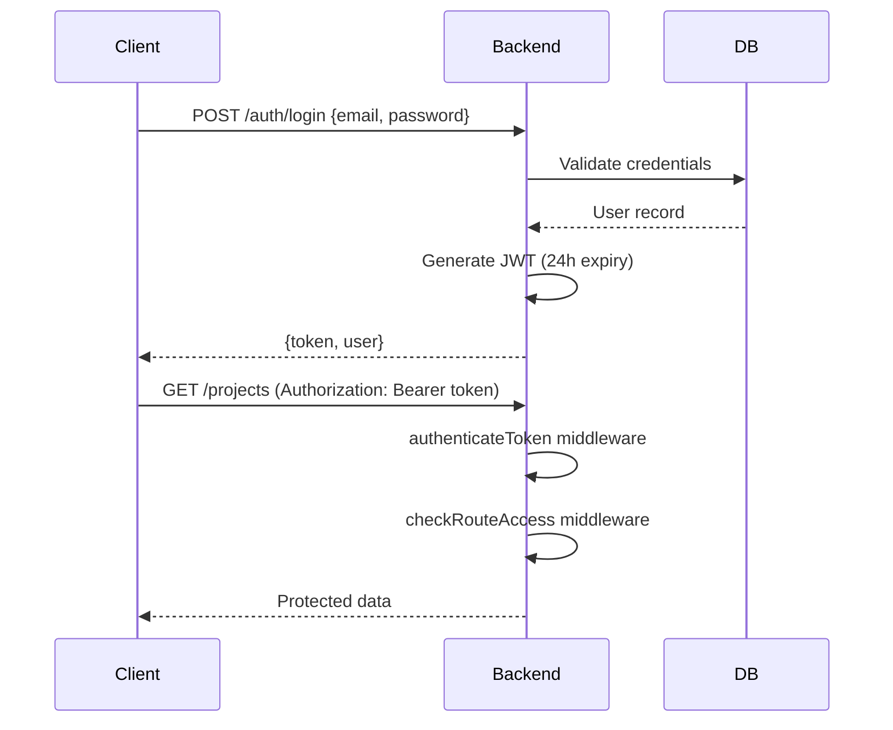
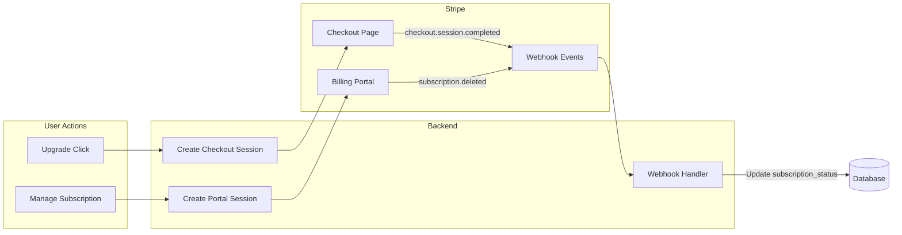
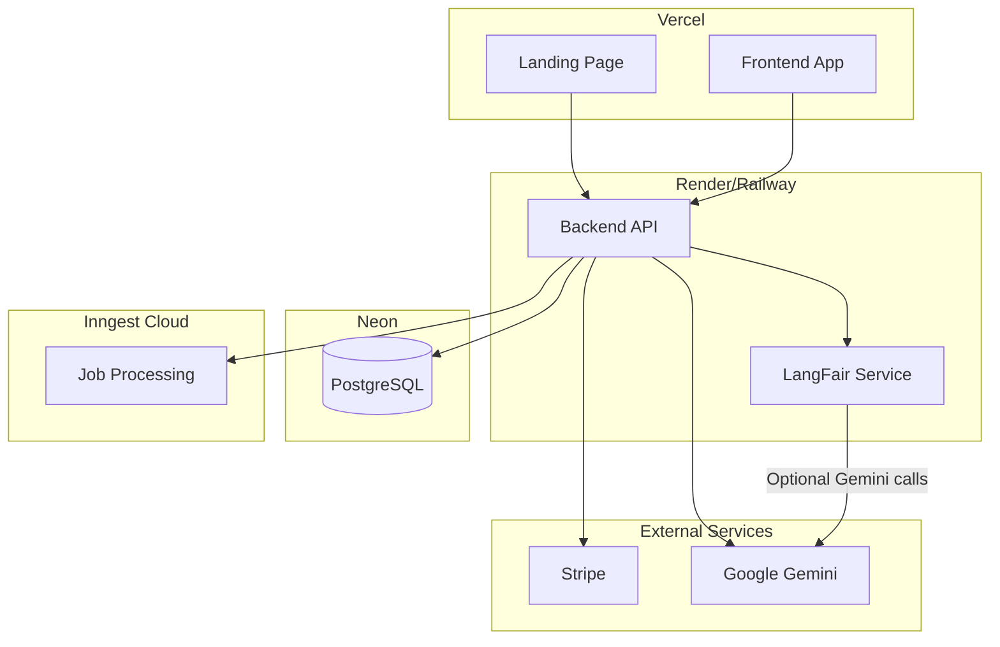

# MATUR.ai Application Architecture

A comprehensive breakdown of the AI Maturity Assessment Platform built using the OWASP AIMA framework.

---

## High-Level Overview



---

## System Components

### 1. Frontend Application (`/frontend`)

| Aspect | Details |
|--------|---------|
| **Framework** | Next.js 14+ with App Router |
| **Styling** | Tailwind CSS |
| **State Management** | React Context API + Zustand Store |
| **Deployment** | Vercel |

**Directory Structure:**
```
frontend/src/
├── app/                      # Next.js App Router pages
│   ├── admin/               # Admin dashboard
│   ├── assess/              # Assessment workflow (15 sub-routes)
│   ├── auth/                # Login/Register/Verify pages
│   ├── dashboard/           # User dashboard
│   ├── manage-subscription/ # Stripe subscription management
│   ├── premium-features/    # Premium tier features
│   ├── score-report-aima/   # AIMA assessment reports
│   ├── score-report-premium/# Premium evaluation reports
│   └── settings/            # User settings
├── components/              # 16 reusable React components
├── contexts/                # Auth, Theme, Subscription contexts
├── hooks/                   # Custom React hooks
├── lib/                     # Utilities (API client, helpers)
└── store/                   # Zustand state management
```

---

### 2. Backend API (`/backend`)

| Aspect | Details |
|--------|---------|
| **Framework** | Express.js + TypeScript |
| **Database** | PostgreSQL via Neon (serverless) |
| **Auth** | JWT tokens with bcryptjs |
| **Payments** | Stripe SDK |
| **Background Jobs** | Inngest |

**Core Routes:**

| Route | Purpose |
|-------|---------|
| `/auth` | User registration, login, MFA, email verification |
| `/projects` | CRUD for assessment projects |
| `/aima` | OWASP AIMA framework data (8 domains, 24 practices, 144 questions) |
| `/answers` | Store/retrieve assessment answers |
| `/fairness` | AI fairness evaluation endpoints |
| `/subscriptions` | Stripe checkout/portal sessions |
| `/admin` | Database resets, admin operations |
| `/webhook` | Stripe webhook handler |

**Service Layer:**

```
backend/src/services/
├── emailService.ts        # Transactional emails
├── evaluateFairness.ts    # Core fairness evaluation orchestration
├── mfaService.ts          # Multi-factor authentication
├── tokenService.ts        # JWT token management
├── getCurrentVersion.ts   # AIMA version tracking
└── getNextVersion.ts      # Version increment logic
```

---

### 3. AI Evaluation Service (`/ai-eval-service`)

A dedicated Python microservice for LLM response evaluation using the **LangFair** library.

| Aspect | Details |
|--------|---------|
| **Framework** | FastAPI |
| **Libraries** | LangFair, Pydantic |
| **Deployment** | Docker container / Render |
| **Purpose** | Toxicity + Stereotype bias detection |

**API Endpoints:**

| Endpoint | Method | Description |
|----------|--------|-------------|
| `/health` | GET | Service health check |
| `/evaluate` | POST | Batch evaluate up to 20 items |

**Evaluation Metrics:**



**How It Works:**
1. FastAPI receives batch evaluation request
2. Spawns `worker.py` subprocess (memory isolation)
3. Worker loads LangFair models (ToxiGen classifier)
4. Evaluates toxicity and stereotype metrics per response
5. Returns JSON results with scores 0.0-1.0

---

## Fairness Evaluation Pipeline

The platform uses a **dual-service evaluation** strategy combining Gemini AI and LangFair:



### Metric Calculation

| Metric | Sources | Weighting |
|--------|---------|-----------|
| **Bias** | Gemini + LangFair stereotype | 60-80% Gemini, 20-40% LangFair (dynamic) |
| **Toxicity** | Gemini + LangFair toxicity | 60% LangFair, 40% Gemini |
| **Relevancy** | Gemini only | 100% Gemini |
| **Faithfulness** | Gemini only | 100% Gemini |

### Verdict Thresholds

| Metric | Low | Moderate | High |
|--------|-----|----------|------|
| Bias | < 0.3 | 0.3-0.7 | > 0.7 |
| Toxicity | < 0.2 | 0.2-0.5 | > 0.5 |
| Relevancy | ≥ 0.7 (Good) | 0.4-0.7 | < 0.4 (Poor) |
| Faithfulness | ≥ 0.7 (Good) | 0.4-0.7 | < 0.4 (Poor) |

---

## Background Job System (Inngest)

The platform uses **Inngest** for reliable background job processing:



### Job Flow

1. **AUTOMATED_API_TEST**: Tests user's external API endpoint
   - Sends prompts to user's API
   - Collects responses
   - Evaluates with fairness pipeline

2. **MANUAL_PROMPT_TEST**: User-provided responses
   - User submits prompt-response pairs
   - Directly evaluates with fairness pipeline

---

## Database Schema



---

## Authentication & Authorization

### JWT Flow



### Role-Based Access

| Role | Access Level |
|------|--------------|
| `USER` | Basic AIMA assessment, 1 project |
| `PREMIUM_USER` | All AIMA + fairness evaluation, unlimited projects |
| `ADMIN` | Full access + admin endpoints |

---

## Subscription System

### Stripe Integration



### Subscription Tiers

| Tier | Price ID Env Var | Status Value |
|------|------------------|--------------|
| Free | N/A | `free` |
| Basic Premium | `STRIPE_PRICE_ID_BASIC` | `basic_premium` |
| Pro Premium | `STRIPE_PRICE_ID_PRO` | `pro_premium` |

---

## Deployment Architecture



---

## Environment Variables

### Backend (`backend/.env`)

```env
# Database
DATABASE_URL=postgresql://...

# Auth
JWT_SECRET=...

# Stripe
STRIPE_SECRET_KEY=sk_...
STRIPE_WEBHOOK_SECRET=whsec_...
STRIPE_PRICE_ID_BASIC=price_...
STRIPE_PRICE_ID_PRO=price_...

# AI Services
GEMINI_API_KEY=...
LANGFAIR_SERVICE_URL=https://...
LANGFAIR_TIMEOUT_MS=30000

# Inngest
INNGEST_SIGNING_KEY=...

# URLs
FRONTEND_URL=https://...
```

### AI Eval Service (`ai-eval-service/.env`)

```env
# Performance
LIGHTWEIGHT_EVAL_MODE=true
TOXICITY_CLASSIFIERS=toxigen
TOXICITY_BATCH_SIZE=1

# Server
HOST=0.0.0.0
PORT=8000
MAX_CONCURRENT_REQUESTS=2
```

---

## Key Technical Decisions

| Decision | Rationale |
|----------|-----------|
| **Dual AI evaluation** | LangFair provides specialized toxicity/stereotype detection; Gemini handles semantic understanding |
| **Inngest for jobs** | Reliable event-driven processing with automatic retries and fan-out |
| **Subprocess isolation** | LangFair models run in isolated process to prevent memory leaks |
| **Neon PostgreSQL** | Serverless scaling, edge caching, minimal cold starts |
| **Weighted score combination** | LangFair scores trusted more for toxicity; Gemini for semantic metrics |

---

## Data Flow Summary

1. **User creates project** → Stored in `projects` table
2. **User completes AIMA assessment** → Answers stored in `assessment_answers`
3. **User submits for fairness evaluation** → `evaluation_status` job created
4. **Inngest orchestrates** → Parallel Gemini + LangFair calls
5. **Results aggregated** → Stored in `fairness_evaluations`
6. **Reports generated** → Rendered in frontend score reports
